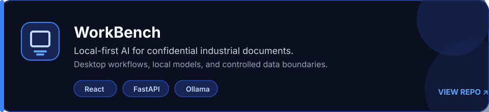
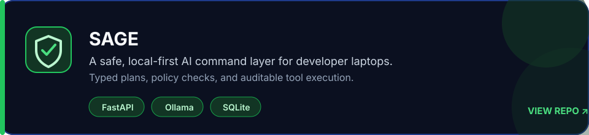
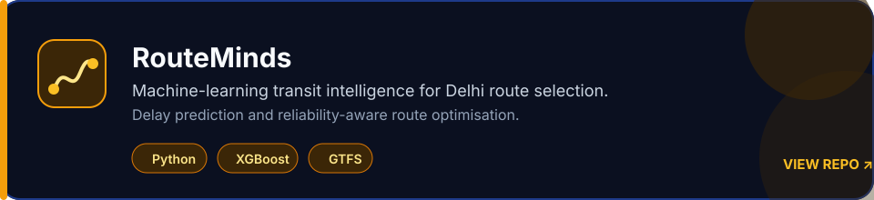
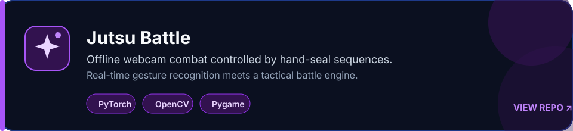

  

  <code>LLM &amp; Agent Systems</code> · <code>Local-First AI</code> · <code>Computer Vision</code> · <code>ML Systems</code> · <code>Backend APIs</code>

## About

Computer Science Engineering student at MAIT ('28), building reliable AI systems across LLM agents, machine learning, computer vision, and backend engineering. I turn ambitious AI ideas into practical systems with clear boundaries and thoughtful design.

I am open to AI/ML engineering internships, technical collaboration, and impactful open-source work.

## Technical Toolkit

  

## Top Projects

   
   
   
  

## Open Source

- **[OWASP BLT](https://owaspblt.org/):** Improved contributor analytics, dashboard usability, chart rendering, and activity-state handling across Django and frontend systems through five merged pull requests.
- **[OpenSRE · Tracer-Cloud](https://github.com/Tracer-Cloud/opensre):** Improved LLM-agent reliability and regression coverage; contributed ten merged pull requests and technical design input for configurable OpenAI- and Anthropic-compatible providers.

## Currently

Building secure, local-first LLM and agent systems while deepening my work in applied computer vision and production ML reliability. I am especially interested in evaluation, safe tool use, deployment, and the engineering decisions that make AI systems dependable.

  
  &nbsp;&nbsp;
  
  &nbsp;&nbsp;
  
  &nbsp;&nbsp;
  

